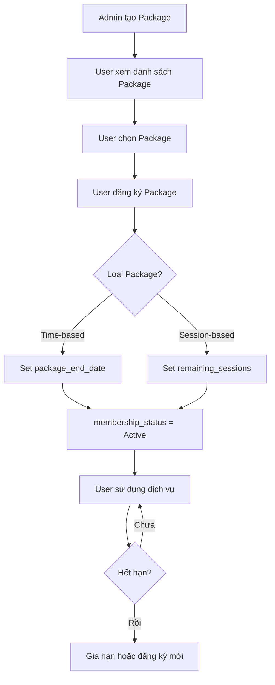

# ✅ PACKAGE-USER INTEGRATION - HOÀN TẤT

## 📊 Tổng Kết Những Gì Đã Làm

### 1. ✅ **Thêm Firestore Rules cho Package**
**File:** `backend/firestore.rules`

```javascript
match /packages/{packageId} {
  allow read: if true; 
  allow write: if true;
}
```

**Lưu ý:** Nhớ deploy rules:
```bash
firebase deploy --only firestore:rules
```

---

### 2. ✅ **Cải Thiện PackageModel**
**File:** `frontend_react/src/firebase/lib/features/package/packages.model.js`

**Thêm các methods:**
- `getById(packageId)` - Lấy package theo ID
- `getAll(filters)` - Lấy tất cả packages (có thể lọc theo status)
- `update(packageId, updateData)` - Cập nhật package
- `delete(packageId)` - Xóa package
- `getFinalPrice()` - Tính giá sau discount
- `calculateEndDate(startDate)` - Tính ngày hết hạn dựa trên Duration

**Imports đã thêm:**
```javascript
import {
  collection, addDoc, Timestamp,
  doc, getDoc, getDocs, updateDoc, deleteDoc,
  query, where, orderBy, serverTimestamp
} from "firebase/firestore";
```

---

### 3. ✅ **Thêm Package Interaction Methods vào UserModel**
**File:** `frontend_react/src/firebase/lib/features/user/user.model.js`

**Import PackageModel:**
```javascript
import { PackageModel } from "../package/packages.model.js";
```

**Thêm 7 methods mới:**

1. `getCurrentPackage()` - Lấy thông tin gói tập hiện tại
2. `registerPackage(packageId, startDate)` - Đăng ký gói tập mới
3. `renewPackage()` - Gia hạn gói tập hiện tại
4. `isPackageActive()` - Kiểm tra gói có còn hiệu lực
5. `getDaysRemaining()` - Số ngày còn lại của gói
6. `useSession()` - Sử dụng 1 buổi tập (gói theo buổi)

**Tính năng tự động:**
- ✅ Tự động tính `package_end_date` dựa trên `Duration`
- ✅ Tự động set `remaining_sessions` cho gói theo buổi
- ✅ Tự động đổi `membership_status` thành "Expired" khi hết buổi
- ✅ Kiểm tra package có tồn tại và active trước khi đăng ký

---

### 4. ✅ **Tạo File Example**
**File:** `frontend_react/src/examples/packageUserExample.js`

**Bao gồm 9 examples:**
1. Admin tạo gói tập theo thời gian
2. Admin tạo gói tập theo buổi
3. Xem danh sách gói tập
4. User đăng ký gói tập
5. Xem thông tin gói tập của user
6. Gia hạn gói tập
7. Sử dụng buổi tập
8. Cập nhật gói tập
9. Workflow hoàn chỉnh

---

### 5. ✅ **Tạo Component UI Example**
**File:** `frontend_react/src/examples/PackageRegistration.jsx`

**Tính năng:**
- Hiển thị danh sách gói tập dạng grid
- Hiển thị thông tin gói tập hiện tại của user
- Cho phép chọn và đăng ký gói tập mới
- Gia hạn gói tập
- Hiển thị discount badge
- Responsive design

---

### 6. ✅ **Tạo Hướng Dẫn Sử Dụng**
**File:** `frontend_react/PACKAGE_USER_GUIDE.md`

**Nội dung:**
- Hướng dẫn cấu hình Firestore Rules
- API reference cho tất cả methods
- Ví dụ use cases
- Troubleshooting
- Best practices

---

## 🎯 Các Tính Năng Chính

### ✅ Cho Admin:
```javascript
// Tạo gói tập
await PackageModel.create({
  PackageName: "Gói 3 Tháng",
  PackageType: "time",
  Duration: 90,
  Price: 2000000,
  Status: "active"
});

// Lấy danh sách gói
const packages = await PackageModel.getAll({ status: "active" });

// Cập nhật gói
await PackageModel.update(packageId, { Price: 2500000 });

// Xóa gói
await PackageModel.delete(packageId);
```

### ✅ Cho User:
```javascript
// Lấy user
const user = await UserModel.getById(userId);

// Đăng ký gói tập
await user.registerPackage(packageId);

// Xem gói hiện tại
const currentPackage = await user.getCurrentPackage();

// Kiểm tra còn hạn không
const isActive = user.isPackageActive();

// Số ngày còn lại
const days = user.getDaysRemaining();

// Gia hạn
await user.renewPackage();

// Check-in (gói theo buổi)
await user.useSession();
```

---

## 🔄 Workflow Hoàn Chỉnh



---

## 📋 Checklist Triển Khai

### Bước 1: Deploy Firestore Rules
```bash
cd backend
firebase deploy --only firestore:rules
```

### Bước 2: Test Package CRUD
```javascript
// Test trong console hoặc tạo script test
import { exampleCreatePackage } from './src/examples/packageUserExample.js';
await exampleCreatePackage();
```

### Bước 3: Test User Registration
```javascript
import { exampleUserRegisterPackage } from './src/examples/packageUserExample.js';
await exampleUserRegisterPackage();
```

### Bước 4: Tích hợp vào UI
```jsx
import PackageRegistration from './examples/PackageRegistration';

function App() {
  return <PackageRegistration userId={currentUserId} />;
}
```

---

## 🚀 Các Bước Tiếp Theo (Optional)

### 1. Tạo Collection Transactions
Để lưu lịch sử giao dịch khi user mua/gia hạn gói:

```javascript
transactions/
  └── {transactionId}/
      ├── user_id: string
      ├── package_id: string
      ├── amount: number
      ├── type: "register" | "renew"
      ├── payment_method: string
      ├── created_at: timestamp
```

### 2. Tích hợp Payment Gateway
- VNPay
- MoMo
- ZaloPay

### 3. Thêm Notification System
Gửi thông báo khi:
- Gói tập sắp hết hạn (7 ngày trước)
- Gói tập đã hết hạn
- Đăng ký gói tập thành công

### 4. Admin Dashboard cho Packages
Tạo trang quản lý package với:
- CRUD operations
- Statistics (số user đăng ký mỗi gói)
- Revenue tracking

---

## 🐛 Troubleshooting

### Lỗi: "Missing or insufficient permissions"
**Giải pháp:** Deploy firestore rules
```bash
firebase deploy --only firestore:rules
```

### Lỗi: "Package không tồn tại"
**Nguyên nhân:** PackageId sai hoặc package đã bị xóa
**Giải pháp:** Kiểm tra lại packageId

### Lỗi: "Không còn buổi tập"
**Nguyên nhân:** User đã hết số buổi trong gói
**Giải pháp:** Yêu cầu user gia hạn hoặc đăng ký gói mới

---

## 📚 Files Đã Thay Đổi

1. ✅ `backend/firestore.rules` - Thêm rules cho packages
2. ✅ `frontend_react/src/firebase/lib/features/package/packages.model.js` - Thêm CRUD methods
3. ✅ `frontend_react/src/firebase/lib/features/user/user.model.js` - Thêm package interaction methods
4. ✅ `frontend_react/src/examples/packageUserExample.js` - Examples
5. ✅ `frontend_react/src/examples/PackageRegistration.jsx` - UI Component
6. ✅ `frontend_react/PACKAGE_USER_GUIDE.md` - Documentation

---

## 🎉 Kết Luận

Hệ thống User-Package đã được tích hợp hoàn chỉnh với các tính năng:

✅ Firestore rules cho packages
✅ PackageModel với đầy đủ CRUD operations
✅ UserModel với methods tương tác package
✅ Tự động tính toán ngày hết hạn
✅ Hỗ trợ 2 loại gói: theo thời gian và theo buổi
✅ Áp dụng discount tự động
✅ Examples và documentation đầy đủ
✅ UI Component mẫu

**Giờ đây user có thể:**
- Xem danh sách gói tập
- Đăng ký gói tập mới
- Gia hạn gói tập
- Check-in và sử dụng dịch vụ
- Xem thông tin gói hiện tại

**Admin có thể:**
- Tạo/sửa/xóa gói tập
- Quản lý giá và discount
- Theo dõi user đăng ký

---

**Tác giả:** GitHub Copilot
**Ngày:** 18/10/2025
**Version:** 1.0.0
